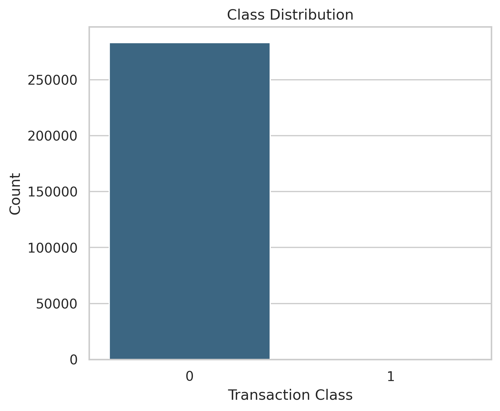
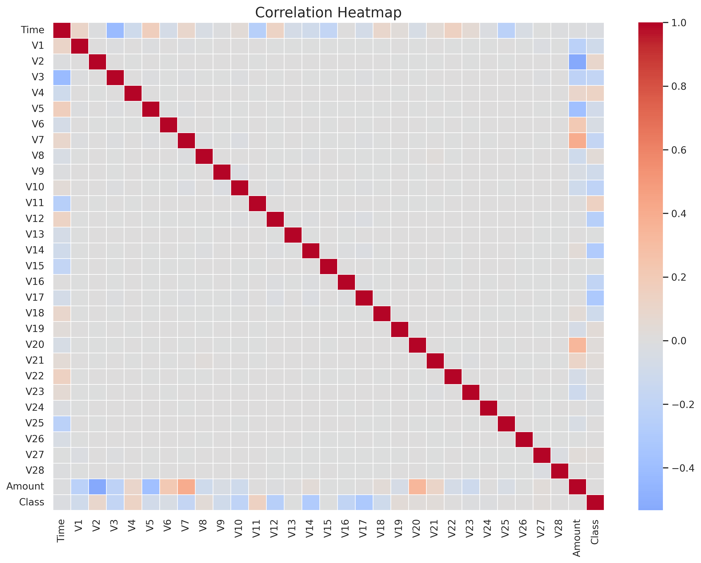
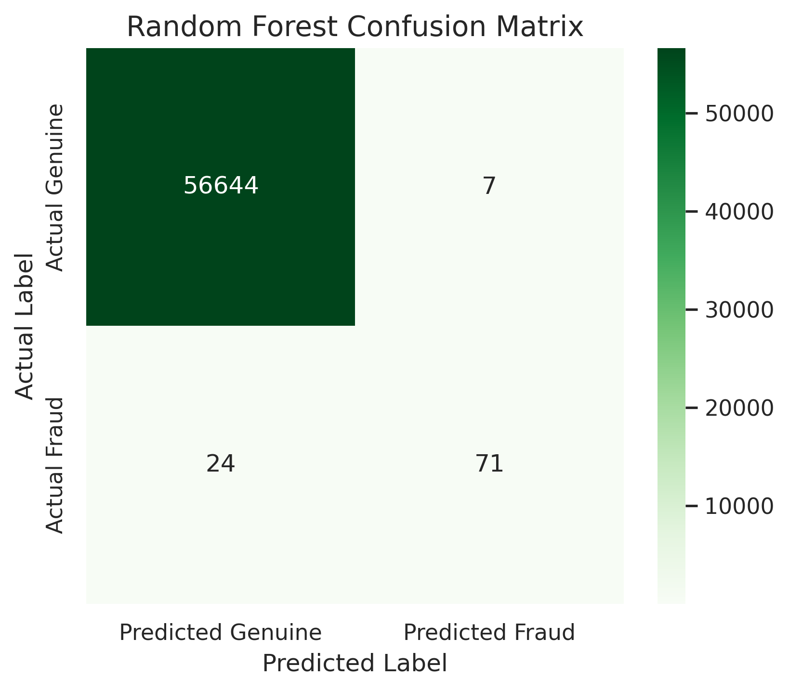
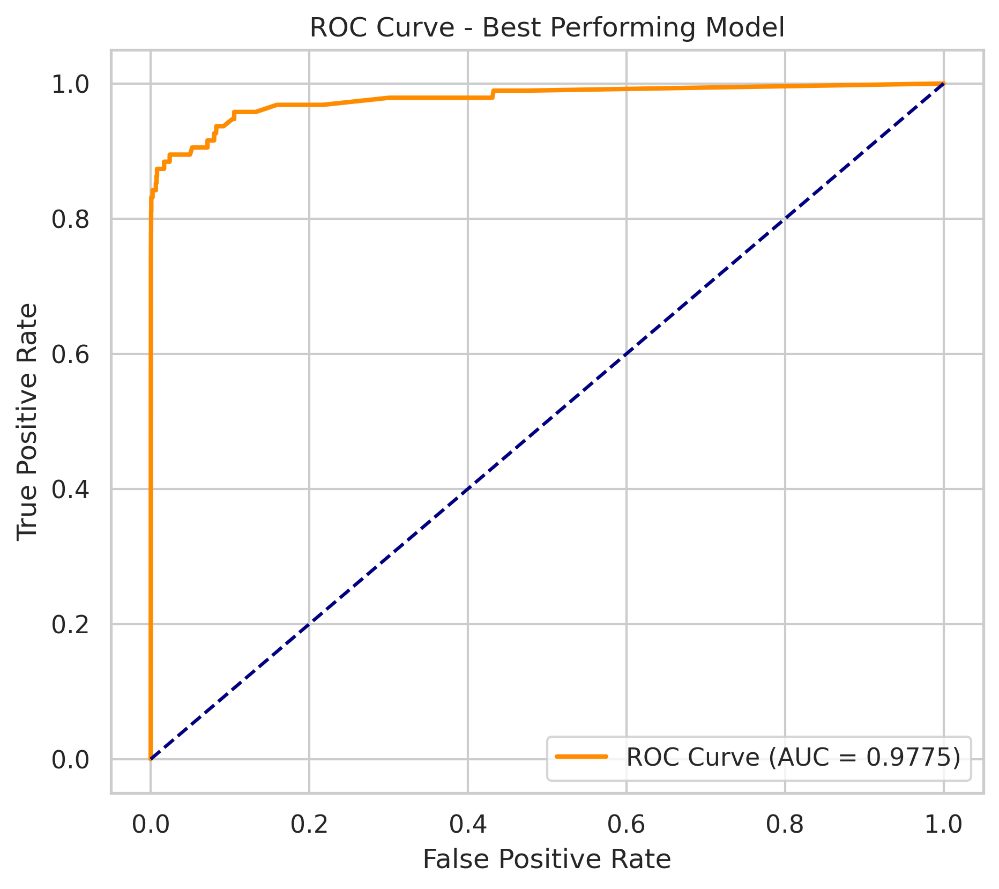
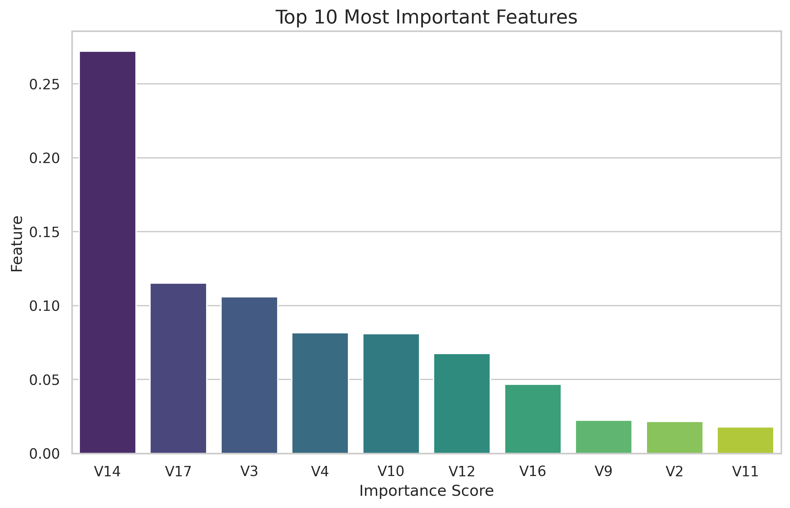
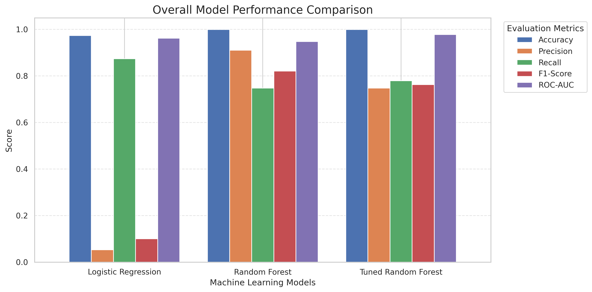

<div align="center">

# 💳 Credit Card Fraud Detection using Machine Learning

### End-to-End Machine Learning Project for Financial Fraud Detection


</div>

---

# 📌 Overview

Financial fraud has become one of the most significant challenges for banks and digital payment platforms. Detecting fraudulent transactions accurately is difficult because fraud cases represent only a very small fraction of all transactions.

This project develops a complete **Machine Learning pipeline** capable of identifying fraudulent credit card transactions while handling severe class imbalance using **SMOTE**.

The project demonstrates the complete Data Science lifecycle, from data preprocessing to business recommendations.

---

# 🎯 Objectives

- Detect fraudulent credit card transactions.
- Handle highly imbalanced data.
- Compare multiple Machine Learning models.
- Improve model performance through Hyperparameter Tuning.
- Recommend the most suitable model for deployment.

---

# 📂 Dataset

**Dataset:** Credit Card Fraud Detection

**Source:** Kaggle

https://www.kaggle.com/datasets/mlg-ulb/creditcardfraud

### Dataset Characteristics

| Feature | Value |
|----------|------:|
| Total Transactions | 284,807 |
| Fraudulent Transactions | 492 |
| Genuine Transactions | 284,315 |
| Features | 31 |
| Target Variable | Class |

---

# ⚙️ Technologies Used

| Category | Tools |
|----------|-------|
| Programming | Python |
| Data Analysis | Pandas, NumPy |
| Visualization | Matplotlib, Seaborn |
| Machine Learning | Scikit-learn |
| Class Balancing | SMOTE |
| Notebook | Google Colab |
| Version Control | Git & GitHub |

---

# 🔄 Machine Learning Workflow

```text
Dataset Collection
        │
        ▼
Data Understanding
        │
        ▼
Exploratory Data Analysis
        │
        ▼
Data Cleaning
        │
        ▼
Feature Scaling
        │
        ▼
Train-Test Split
        │
        ▼
SMOTE
        │
        ▼
Model Building
        │
        ▼
Hyperparameter Tuning
        │
        ▼
Model Evaluation
        │
        ▼
Business Recommendations
```

---

# 🤖 Models Implemented

- Logistic Regression
- Random Forest Classifier
- Tuned Random Forest (RandomizedSearchCV)

---

# 📊 Evaluation Metrics

The models were evaluated using:

- Accuracy
- Precision
- Recall
- F1-Score
- ROC-AUC

> **Note:** Since fraud detection is an imbalanced classification problem, Recall, F1-Score, and ROC-AUC were prioritized over Accuracy.

---

# 📸 Project Visualizations

## 1️⃣ Class Distribution



---

## 2️⃣ Correlation Heatmap



---

## 3️⃣ Random Forest Confusion Matrix



---

## 4️⃣ ROC Curve (Best Model)



---

## 5️⃣ Feature Importance



---

## 6️⃣ Overall Model Comparison



---

# 📁 Repository Structure

```text
Project-02/
│
├── Fraud_Detection.ipynb
├── creditcard.csv
├── README.md
├── requirements.txt
├── .gitignore
│
├── images/
│   ├── class_distribution.png
│   ├── correlation_heatmap.png
│   ├── feature_importance.png
│   ├── overall_model_comparison.png
│   ├── random_forest_confusion_matrix.png
│   └── roc_curve_best_model.png
│
└── outputs/
    ├── model_metrics.csv
    ├── classification_report.txt
    └── best_hyperparameters.txt
```

---

# 💼 Business Recommendations

- Deploy the best-performing model for real-time fraud detection.
- Continuously retrain the model using newly available transaction data.
- Implement risk-based authentication (OTP/MFA) for suspicious transactions.
- Monitor Recall, F1-Score, and ROC-AUC after deployment.
- Reduce false positives to improve customer experience.
- Route high-risk transactions for manual review.

---

# 🚀 Future Enhancements

- Build a Streamlit dashboard.
- Deploy using Flask/FastAPI.
- Integrate with payment APIs.
- Use SHAP or LIME for explainable AI.
- Experiment with XGBoost, LightGBM, and CatBoost.
- Explore deep learning approaches.

---

# ▶️ Getting Started

### Clone the repository

```bash
git clone https://github.com/ajayparmar2510/DecodeLabs-Internship.git
```

### Navigate to the project

```bash
cd DecodeLabs-Internship/Project-02
```

### Install dependencies

```bash
pip install -r requirements.txt
```

### Run the notebook

Open `Fraud_Detection.ipynb` in Jupyter Notebook or Google Colab and execute all cells.

---

# 📄 Project Outputs

The `outputs/` folder contains:

- `model_metrics.csv`
- `classification_report.txt`
- `best_hyperparameters.txt`

---

# 👨‍💻 Author

**Ajay Parmar**

🎓 Aspiring Data Scientist | Machine Learning Enthusiast

- GitHub: https://github.com/ajayparmar2510
- LinkedIn: *(Add your LinkedIn profile URL here)*

---

<div align="center">

### ⭐ If you found this project useful, consider giving it a Star!

</div>